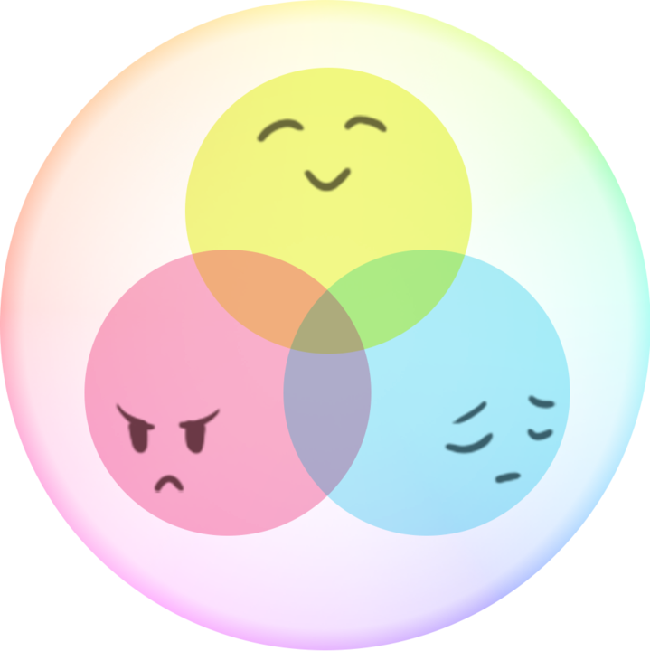

<h1 align="center">
  <br>
 </a>
  <br>
  Vibe Check
  <br>
</h1>

<h4 align="center"> Reflect and check in on your vibes.</h4>

<p align="center">
  <a href="#key-features">Key Features</a> •
  <a href="#how-to-use">How To Use</a> •
</p>


## Key Features

* Scheduled notifications
  - Flexibility in selecting the frequency and timing of pings 
* Simple mood reflections
  - One emoji and a brief sentence!
* Graphical representations of your mood over time:
  - WordCloud
  - Bar plots highlighting different frequencies  
* Ability to customize app-theme to any color desired
* Choose what _you_ want to see!
  - Delete and/or rearrange the placement of graphics cards
* Cross-platform
  - Android and iOS ready.

## How To Use

To clone and run this application, you'll need [Git](https://git-scm.com) and [Node.js](https://nodejs.org/en/download/) (which comes with [npm](http://npmjs.com)) installed on your computer. From your command line:

```bash
# Clone this repository
$ git clone https://github.com/amitmerchant1990/electron-markdownify

# Go into the repository
$ cd electron-markdownify

# Install dependencies
$ npm install

# Run the app
$ npm start
```

## Credits

This software uses the following open source packages:

- [Electron](http://electron.atom.io/)
- [Node.js](https://nodejs.org/)
- [Marked - a markdown parser](https://github.com/chjj/marked)
- [showdown](http://showdownjs.github.io/showdown/)
- [CodeMirror](http://codemirror.net/)
- Emojis are taken from [here](https://github.com/arvida/emoji-cheat-sheet.com)
- [highlight.js](https://highlightjs.org/)

