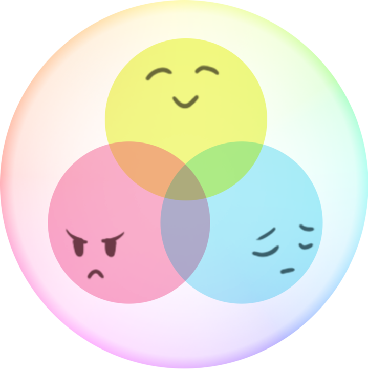
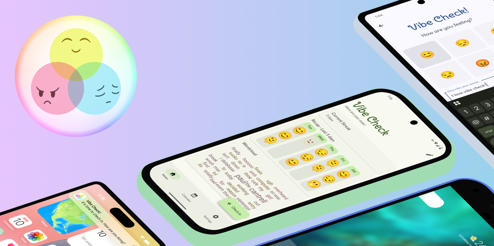

<h1 align="center">
   
 </a>
   
  Vibe Check
   
</h1>

<h4 align="center"> Reflect and check in on your vibes.</h4>

  <a href="#key-features">Key Features</a> •
  <a href="#how-to-use">How To Use</a>

<h1 align="center">
 </a>
</h1>

## Key Features

* "Vibe Check!" Scheduled Reminders
  - Choose to be notified to check in daily at your own customizable times.
* Simple mood reflections
  - One emoji and a brief sentence! That's all Vibe Check needs to show you your vibes.
* Graphical representations of your mood over time:
  - WordCloud - see what words have been the most used in your vibes.
* Customization focused - Choose what *you* want to see!
  - Delete and/or rearrange the placement of cards
  - Use Material You or another color for theming
  - and more...
* Works on Android and iOS!

## How to Use

This application uses the Flutter SDK. 
The quickest way to get set up is to clone this repository, and use `fvm` to set up the appropriate flutter version for you.

## About this app

Made with ♡ by [stelubretu](https://github.com/luna-mm/vibe_check/graphs/contributors).

This app was made for a class project! :)

**COMP 225 - Macalester College** | Professor Paul Cantrell - Spring 2025